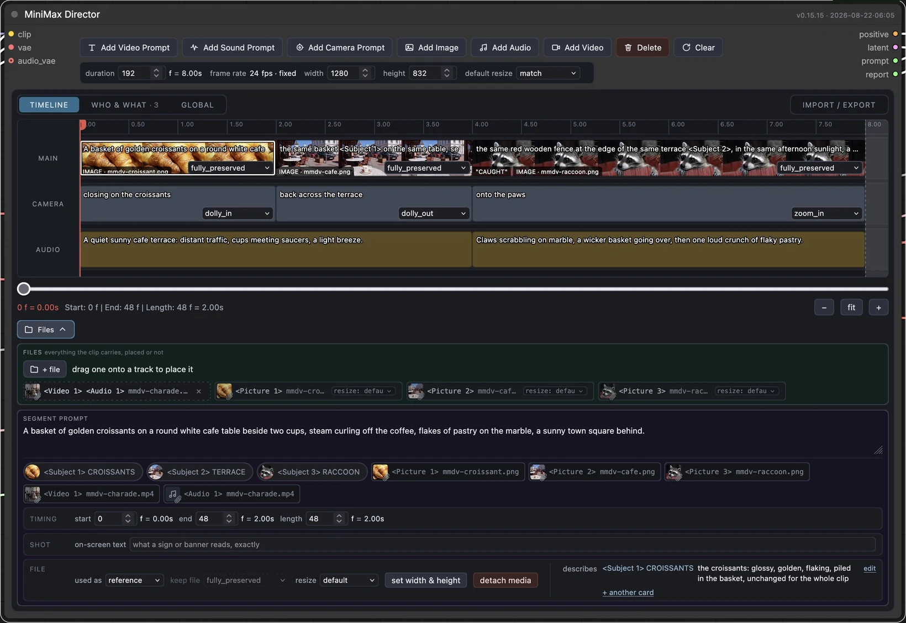
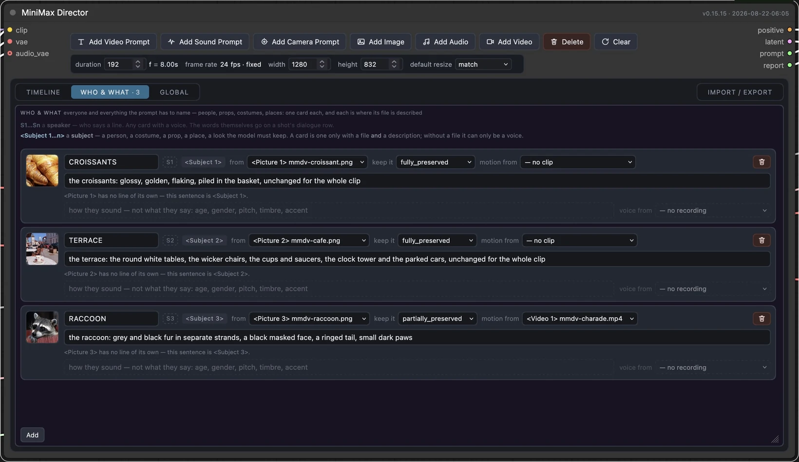

# MiniMaxDirector

A timeline director for the [MiniMax H3](https://huggingface.co/MiniMaxAI/MiniMax-H3)
video model in ComfyUI. Lay out shots, camera moves and audio cues on a track, and it
compiles them into the single structured prompt H3 actually reads — then hands the model
its conditioning and a clip length the sampler will accept.





**A video tutorial is on the way** — a few days, a week at the outside.

H3 makes the picture and the voices in one pass, so the editor has a **WHO & WHAT** tab: one
card per thing the prompt has to name, holding its face, its voice, how much of it survives
from a reference, and — for a face swap — who the face is carried onto, which folds the
card into that person rather than adding a second one. Not only people: a costume, a prop,
a place or a style out of the same photograph is a card too, and several cards may point at
one file. A card can also take a person's motion from a video and their voice timbre from a
recording — the guide's one-subject-several-assets case, and the same machinery a face swap
now uses. A shot then only says who speaks and what they say.

A card is also the one place a file is described — there is no second description box on
the block, because a file used to define something is cited inside that thing's definition
rather than given a line of its own. Citing one in a shot is a click: the block's
**SUBJECTS** row is a chip per numbered card, and clicking it writes `<Subject n>` into the
shot's text at the caret, so the number is never typed and never wrong.

The compiler covers MiniMax's published prompt guides rather than a subset of them: the
full camera vocabulary as motion type × amplitude × speed, voiceovers in the exact form
the model was trained on, dialogue that crosses a cut or is cut off by the end of the
clip, on-screen text quoted verbatim, storyboard references, the separate marker
vocabulary audio uses, and a linter that checks the rules the guides state outright.

The editor is content-sized: the node is as tall as the panel you have open, and the card
list is the only part with a height of its own — set by its grip or by the node's corner,
stored on the node, restored with the workflow.

It ships as a whole workflow, not just a node pack: `examples/minimax-director.json` is a
complete graph — timeline, live compiled-prompt view, loaders, sampler, both VAE decodes
and video out. Install it, open it, start writing shots. See **[Install](#install)**.

MIT licensed. The pack has no dependencies beyond ComfyUI itself; the workflow's
optional **Upscale** switch is the one thing that asks for another pack, and it is off
by default.

## Where this came from

I loved [LTXDirector](https://github.com/WhatDreamsCost/WhatDreamsCost-ComfyUI). Directing
a video by laying shots out on a timeline, instead of cramming everything into one prompt
box and hoping, is the right idea — and WhatDreamsCost got there first and built it
properly. Thank you for it.

MiniMaxDirector is that idea carried over to MiniMax H3. It is not a port: none of
LTXDirector's code is here, and the two models want different things. LTX needs keyframes
injected into latent space because it has no notion of a shot list; H3's text encoder is a
32B vision-language model that reads one itself, so the same idea comes out as a compiler
rather than a guide injector. The debt is to the concept, and it is a large one.

If you work with LTX, use LTXDirector — it is more mature than this, and it is the
original.

People searching for an LTXDirector for MiniMax H3 tend to land here, so to be clear:
this is not that. It is a separate project, written from scratch for a different model,
built on an idea LTXDirector had first.

## Why a compiler rather than latent guides

H3's text encoder is a 32B vision-language model, and it parses a shot list on its own:

```
Neon-lit alley after rain, cyan and magenta signage, 35mm grain.

Timeline:
[0s-1s] Wide shot of the alley, puddles holding the sign reflections. The camera dollies slowly in.
[1s-2.5s] Close on <Picture 1>, rain beading on the collar.
```

So the interesting work is not injecting guides into latent space — it is producing that
text correctly, addressing wired inputs as `<Picture 1>` / `<Audio 1>`, and keeping the
clip on the frame lattice H3 requires. All of that is ordinary logic, which is why the
core of this project is pure Python with no tensors in it and runs in a fifth of a second
on a laptop.

## The frame lattice

H3 only accepts clip lengths satisfying `length % 17 == 5` at 24 fps — 5, 22, 39, 56, 73,
90, 107, 124, and so on. The model denoises a latent whose time axis is a row of slots, and
the video VAE packs 17 frames into 5 of them (after a 5-frame head worth 2); a length off
the lattice would need a fraction of a slot.

The editor lands on it while you build rather than at render time: a block that grows the
clip takes the padding, and a typed duration snaps up on its own. So the timeline you
arrange is the clip that is generated, with no frames on the end that no shot describes.

## Nodes

| Node | Purpose |
| --- | --- |
| `MiniMax Director` | Timeline editor; outputs `positive`, `latent`, the compiled `prompt`, and a lint `report`. |
| `MiniMax Director — Prompt` | Shows the compiled prompt as the timeline is edited, without running anything. Wire the director's `prompt` output to it. |
| `MiniMax Director — Report` | Shows the linter's findings as the timeline is edited. Wire the director's `report` output to it. |

Three nodes, and the shipped workflow uses all three. There is no separate compile node,
no seconds-to-frames node, and no `length` output on the director: the timeline's own
clock reads the frame count in frames and seconds, the rounded length rides in the
`latent` the sampler receives, and the editor compiles and lints on every edit pause. Each
of the three was a second route to something already on screen.

The director calls the core `MiniMaxH3ImageToVideo` / `MiniMaxH3ReferenceToVideo` nodes
rather than reimplementing them, resolving both by introspection so an upstream signature
change surfaces as a clear message instead of a stack trace. The path is picked automatically from the
timeline: no files and you get text-to-video, a block used as `first frame` or `last frame`
and you get image-to-video, any other attached file and you get reference-to-video. The
node has no reference or keyframe sockets of its own -- every file comes off the timeline,
which is the one place a file is also described.

## Install

Three steps: the nodes, the weights, the workflow. The nodes on their own leave you with a
timeline and nothing to render it — the graph around them is the product, and it ships here
as `examples/minimax-director.json`.

Requires ComfyUI 0.31.0 or newer. The nodes themselves work on 0.30.0, where the MiniMax
H3 nodes landed, but the workflow's **Turbo** switch needs `ModelSamplingAV` from 0.31.0 —
without it the audio is over-stepped at four steps and comes back distorted while the
picture looks fine.

**1. The nodes.**

```
cd ComfyUI/custom_nodes
git clone https://github.com/imbutus/ComfyUI-MiniMaxDirector.git
```

Restart ComfyUI.

**2. The weights.** Four files, all from
[`Comfy-Org/MiniMax-H3`](https://huggingface.co/Comfy-Org/MiniMax-H3). These are the exact
filenames the example workflow asks for; ComfyUI matches loaders to files by name, so a
differently named copy shows up as an empty dropdown rather than an error.

| File | Goes in |
| --- | --- |
| `minimax_h3_ref2va_pruned_int8_convrot.safetensors` | `models/diffusion_models/` |
| `qwen3vl_32b_minimax_h3_nvfp4_awq.safetensors` | `models/text_encoders/` |
| `minimax_h3_video_vae_fp16.safetensors` | `models/vae/` |
| `minimax_h3_audio_vae_fp32.safetensors` | `models/vae/` |

Two VAEs is not a mistake. H3 generates picture and sound together, and they decode
separately.

**3. The workflow.** Drag `examples/minimax-director.json` onto the ComfyUI canvas, or open
it from the Workflows sidebar. It wires up:

- **MiniMax Director** — the timeline you work in.
- **MiniMax Director — Prompt** — the compiled prompt, beside it, updating as you type.
- **MiniMax Director — Report** — the linter's findings, above it. Almost every
  "why did it do that" is answered by those two panels.
- the loaders, sampler, both VAE decodes, `CreateVideo` and `SaveVideo` — everything
  needed to get an mp4 with sound out the other end.
- two switches, both off by default: **Turbo** in the *Speed* group and **Upscale** in the
  *Upscale* group — described below, with what each one needs.

Select a block, describe what happens in it, queue.

**Faster, when you want it.** The **Turbo** switch in the workflow's *Speed* group swaps
the sampler to a distilled four-step one: 4 steps instead of 20, so a draft costs roughly a
fifth of the GPU time. Off by default — the graph renders exactly as it would without the
switch there.

It needs one extra file in `models/loras/`,
[lightx2v's Ref2VA 4-step LoRA](https://huggingface.co/lightx2v/Minimax-h3-Turbo)
(`minimax_h3_ref2v_turbo_4step_v0.1_comfyui_bf16.safetensors`), and **no extra node pack** —
it loads through ComfyUI's own `LoraLoaderModelOnly`. Distilled at 544p on the shifts H3
already defaults to, so leave its strength at 1.0 and the scheduler on `simple`.

Ref2VA turbo is a v0.1 preview: audio and fast motion are its weak spots. Switch it off for
a final render.

**Bigger, when you want it.** The **Upscale** switch in the workflow's *Upscale* group adds
a second stage: the finished latent is enlarged to the node's `megapixels` target and refined
there.
Off by default, and off it costs nothing — nothing below the branch runs.

Render first, look at it, and only then pay for the resolution. Flip Upscale on and queue
the same graph again: nothing upstream changed, so ComfyUI serves the first pass from its
cache and only the second one costs anything. That second pass is a real render at the
larger size — it costs time and VRAM, not just the download.

`megapixels` is a **budget of pixels** — not a multiplier, and not a width. The node reads it
as `megapixels × 1024 × 1024`, spends that many pixels at the aspect ratio the render already
has, and rounds both sides to the nearest `align`. It is area rather than width, so doubling
the number makes the picture about 1.41× wider, not twice as wide. From the default 1344×768
canvas — 0.98 MP by that count:

| megapixels | you get |
|---|---|
| 2.0 | 1920 × 1088 |
| 4.0 | 2720 × 1536 |
| 7.0 | 3584 × 2048 |
| 9.0 | 4064 × 2336 |

To aim at a size you already have in mind, divide its pixel count by 1,048,576: 3600×2024 is
6.95, so 7.0 — which lands on 3584×2048, because the shape stays the canvas's whatever number
you type.

This is the one part of the graph that needs a second node pack:

```
cd ComfyUI/custom_nodes
git clone https://github.com/LBH-123-AI/Comfyui_Minimax_h3_latent_Upscaler.git
```

and `minimax_h3_latent_upscaler_3d_fp16.safetensors` (691MB) from
[`LBH-123-AI/Minimax_h3_latent_Upscaler`](https://huggingface.co/LBH-123-AI/Minimax_h3_latent_Upscaler)
in `models/latent_upscale_models/`, the folder that pack registers.

Without the pack, ComfyUI opens the workflow with a Missing Node Types dialog and one red
node. That is expected, not a broken download: the switch is off, nothing downstream of it
is used, and the render works. Install the pack when you want the branch.

That pack is days old and still moving: on 2026-08-19 it renamed its nodes, and a graph
pointing at the old name stopped opening. This workflow tracks the current one,
`MinimaxH3LatentUpscaler3D`. If yours is older than that rename, `git pull` in the pack.

The upscaler works directly on H3's 24-channel latents, so nothing round-trips through the
VAE. H3's latent carries picture and sound together, though, and the upscaler takes the video
half alone — so the branch splits the audio off with core `Separate AV Latent`, upscales, and
rejoins with `Concat AV Latent` before the refine pass. It is new and unproven at large sizes
— check a short clip before trusting it with a long one.

This is why the workflow is one file and not several. Turbo needs no pack at all; Upscale
needs that one, and only when you switch it on.

## Development

The parts worth testing need neither a GPU nor a single byte of weights.

```
python -m venv .venv && .venv/bin/pip install -e ".[dev]"
.venv/bin/pytest
```

For the graph itself, point `COMFYUI_PATH` at a ComfyUI checkout and the graph tests run a
real prompt through ComfyUI's own validator and executor — no server, no GPU, no model
files:

```
COMFYUI_PATH=~/dev/ComfyUI $COMFYUI_PATH/.venv/bin/python -m pytest tests/graph
```

The weight-bearing nodes are stubbed; `CreateVideo` and `SaveVideo` are not, so the run
ends with an actual mp4 on disk. The stubs record every prompt handed to H3, which makes
the one question that matters — *what string reached the text encoder?* — directly
assertable without renting anything.

The stubs live in `tests/`, not in the package, and they have to: ComfyUI snapshots its
built-in node names before loading custom nodes and refuses to let a pack replace any of
them (`nodes.py`, `base_node_names` passed as `ignore`). A test process has no such
restriction, because it owns the registry.

## Documentation

- **[docs/GUIDE.md](docs/GUIDE.md)** — how to use it: the tracks and buttons, the duration
  rules, reference tokens, the camera vocabulary, the frame lattice, and what to check
  when the output looks wrong. Start here.
- **[AGENTS.md](AGENTS.md)** — the same ground for a model reading the code cold: data
  flow, document schema, numbering rules, the invariants that break silently, and what
  has never been verified against real weights.
- **[docs/ARCHITECTURE.md](docs/ARCHITECTURE.md)** — why the design is shaped this way.

## Layout

```
__init__.py              ComfyUI entry point
src/minimax_director/
  lattice.py             frame arithmetic; the 17-frame rule
  timeline.py            the timeline document and its JSON
  compile.py             timeline -> prompt
  cast.py                the WHO & WHAT document, merged in before compiling
  lint.py                checks that run before sampling
  references.py          reference ordinals for wired sockets
  attachments.py         reference ordinals for files on the timeline
  core.py                adapter over ComfyUI's built-in H3 nodes
  nodes/                 the classes ComfyUI registers
web/                     the timeline widget: plain ES modules, no build step
examples/                the ready-to-run workflow
tests/                   pure-Python tests and golden prompts
tests/graph/             in-process ComfyUI execution with the weights stubbed
AGENTS.md                how it all works, for contributors and coding agents
```
